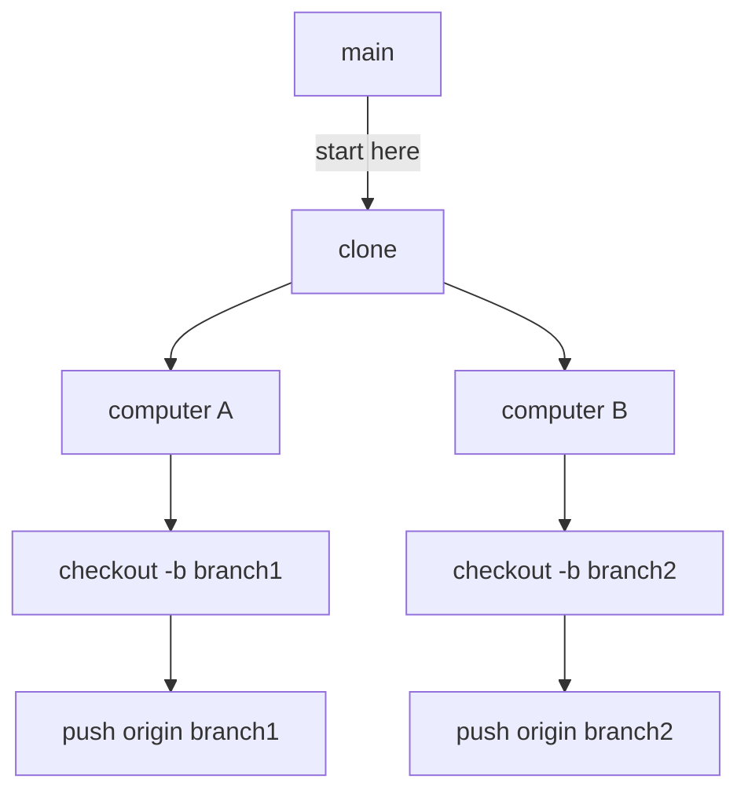

<table>
  <thead>
    <tr>
      <td align="center">
        :warning: PERHATIAN
      </td>
    </tr>
  </thead>

  <tbody>
    <tr>
      <td>
        <ul>
          <li>Setiap ada footnotes, kata pengantar, wajib dibaca. Bisa jadi kalian juga belum paham dengan beberapa istilah yang muncul di sini.</li>
          <li>Baca dokumentasi yang telah dibuat oleh penulis secara berurutan.</li>
        </ul>
      </td>
    </tr>
  </tbody>
</table>

## Pengantar

Ini adalah sebuah repositori[^1] tempat kalian memutuskan diri kalian sendiri untuk belajar bahasa pemrograman atau istilah kerennya ialah **100 Days of Code**, dimana kalian harus memahami materi dan menyelesaikan tugas perharinya selama 100 hari.

Btw, repositori ini **made in ❤️ (love)**, tidak membutuhkan biaya sedikitpun, tapi membutuhkan waktu yang cukup banyak.

Penulis akan selalu berusaha untuk update perharinya.

## Prasyarat Sebelum Bermain

1. Kalian harus memasang beberapa dependensi[^2] :

| Dependesi                                            | Fungsi                                                                                                                                |
| ---------------------------------------------------- | ------------------------------------------------------------------------------------------------------------------------------------- |
| [Visual Studio Code](https://code.visualstudio.com/) | Untuk mengedit teks                                                                                                                   |
| [Git](https://git-scm.com/)                          | melacak perubahan pada file dan proyek perangkat lunak, memfasilitasi kolaborasi tim, dan memungkinkan manajemen revisi yang efisien. |
| [Python](https://www.python.org/)                    | bahasa pemrogramannya                                                                                                                 |

2. Harus (setidaknya) memahami perintah Git[^3]. Jika belum memahaminya, bisa lihat referensi yang telah dibuat:

| [Referensi Perintah Git](./git_references.md) |
| --------------------------------------------- |

## Cara Main

Seperti apa yang telah dijelaskan, ini adalah sebuah permainan **100 Days of Code**. Semua permainan pasti punya cara mainnya tersendiri, jadi mohon diperhatikan dengan baik, yang harus kalian lakukan adalah:

1. Kamu bisa pergi kesini:

| [Hari Pertama - Get Started](./day_1/1_get_started.md) |
| ------------------------------------------------------ |

2. Masuk kedalam folder di mana anda akan menyimpan projek ini
3. Lakukan clone repositori

```bash
# clone repositori ini jika kalian menggunakan https:
git clone https://github.com/mzmunechika/python_for_beginners.git
```

```bash
#clone repositori ini jika kalian mengguanak ssh:
git clone git@github.com:mzmunechika/python_for_beginners.git
```

4. Masuk kedalam folder projek ini
5. Langsung buat branch[^4] dengan menjalankan perintah:

```bash
git checkout -b NAMA_BRANCH_KAMU
```

6. Buka Visual Studio Code milikmu.
7. Pahami materi dan selesaikan tugasnya

## Alur Kerja



## Footnotes

[^1]: Repositori adalah tempat penyimpanan digital yang digunakan untuk mengorganisir dan menyimpan kode sumber, file, atau proyek lainnya dalam pengembangan perangkat lunak atau pengelolaan versi.
[^2]: Dependensi merupakan alat atau komponen yang diperlukan sebelum menjalankan atau menggunakan suatu program, aplikasi, atau bahasa pemrograman. Dependensi bisa berupa pustaka (library), modul, framework, bahasa pemrograman, atau perangkat lunak lainnya yang dibutuhkan untuk menjalankan suatu program atau membangun suatu aplikasi. Sebelum menggunakan atau menjalankan program tersebut, Anda perlu memastikan bahwa dependensi yang diperlukan sudah terinstal dengan benar di lingkungan kerja Anda.
[^3]: Git adalah sistem kontrol versi yang digunakan untuk melacak perubahan pada file dan proyek, serta memungkinkan kolaborasi tim dalam pengembangan perangkat lunak.
[^4]: Branch pada Git adalah salinan independen dari repositori yang memungkinkan pengembang untuk membuat, mengedit, dan menguji perubahan kode tanpa mempengaruhi branch utama (default) atau branch lainnya.
